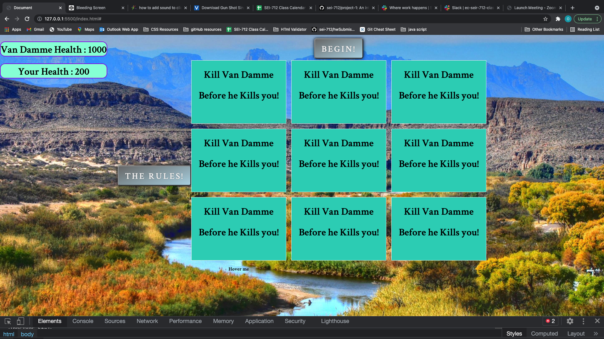

# Project1

## Summary

This game is designed as a Shooter aka clicker. 
I imagined a whack a mole type game but with a bow and arrow orginally. but as the project went on it evolved into something a little different. i decided to use van damme as the target and imagine he was an evil doppleganger from another universe. Anyway I used a for loop to clear the board and a couple randoms code to make the Hostages and vandamme appear in random places.

### Livesite link
[Kill Van Damme Game](https://evolvd444.github.io/Project1/#)

### Technologies
- Javascript
- Css
- HTML
- DOM

## Rules of the Game
Van Damme before he kills you.
- You will take damage if you miss -10 hp
- He will take damage if you shoot him before he turns
- You can click multiple times but becareful if you click while he is still turning it will count as a miss and you will lose points.
- If you shoot a hostage you will lose -10 hp
- If van Dammes health goes to zero before yours you win. if not you lose.
- Have fun

### No installation required
### Unsolved Problems
- i would like it to be more responsive.

A README.md file with explanations of the technologies used, the approach taken, a link to your live site, installation instructions, unsolved problems, etc.